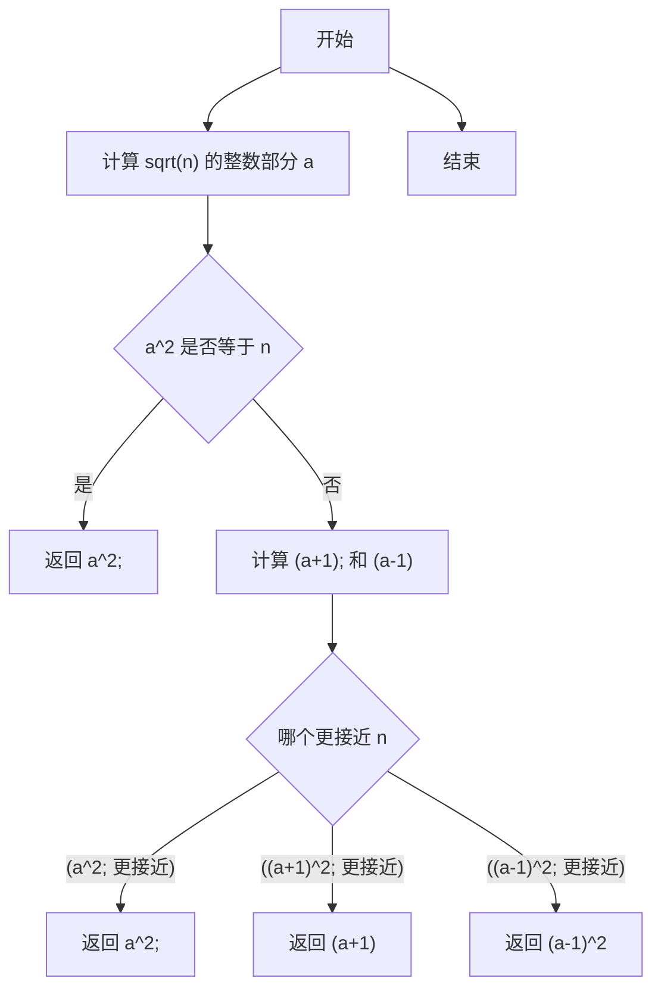

# 实验二 Python变量、简单数据类型

班级： 21计科2班

学号： B20210302211

姓名： 刘鑫

Github地址：<https://github.com/leonidluo/python_course>

CodeWars地址：<https://www.codewars.com/users/Leonid712>

---

## 实验目的

1. 使用VSCode编写和运行Python程序
2. 学习Python变量和简单数据类型

## 实验环境

1. Git
2. Python 3.10
3. VSCode
4. VSCode插件

## 实验内容和步骤

### 第一部分

实验环境的安装

1. 安装Python，从Python官网下载Python 3.10安装包，下载后直接点击可以安装：[Python官网地址](https://www.python.org/downloads/)
2. 为了在VSCode集成环境下编写和运行Python程序，安装下列VScode插件
   - Python
   - Python Environment Manager
   - Python Indent
   - Python Extended
   - Python Docstring Generator
   - Jupyter
   - indent-rainbow
   - Jinja

---

### 第二部分

Python变量、简单数据类型和列表简介

完成教材《Python编程从入门到实践》下列章节的练习：

- 第2章 变量和简单数据类型

---

### 第三部分

在[Codewars网站](https://www.codewars.com)注册账号，完成下列Kata挑战：

---

#### 第1题：求离整数n最近的平方数（Find Nearest square number）

难度：8kyu

你的任务是找到一个正整数n的最近的平方数
例如，如果n=111，那么nearest_sq(n)（nearestSq(n)）等于121，因为111比100（10的平方）更接近121（11的平方）。
如果n已经是完全平方（例如n=144，n=81，等等），你需要直接返回n。
代码提交地址
<https://www.codewars.com/kata/5a805d8cafa10f8b930005ba>


---

#### 第2题：弹跳的球（Bouncing Balls）

难度：6kyu

一个孩子在一栋高楼的第N层玩球。这层楼离地面的高度h是已知的。他把球从窗口扔出去。球弹了起来,  例如:弹到其高度的三分之二（弹力为0.66）。他的母亲从离地面w米的窗户向外看,母亲会看到球在她的窗前经过多少次（包括球下落和反弹的时候）？

一个有效的实验必须满足三个条件：

- 参数 "h"（米）必须大于0
- 参数 "bounce "必须大于0且小于1
- 参数 “window "必须小于h。

如果以上三个条件都满足，返回一个正整数，否则返回-1。
**注意:只有当反弹球的高度严格大于窗口参数时，才能看到球。**
代码提交地址
<https://www.codewars.com/kata/5544c7a5cb454edb3c000047/train/python>


---

#### 第3题： 元音统计(Vowel Count)

难度： 7kyu

返回给定字符串中元音的数量（计数）。对于这个Kata，我们将考虑a、e、i、o、u作为元音（但不包括y）。输入的字符串将只由小写字母和/或空格组成。

代码提交地址：
<https://www.codewars.com/kata/54ff3102c1bad923760001f3>


---

#### 第4题：偶数或者奇数（Even or Odd）

难度：8kyu

创建一个函数接收一个整数作为参数，当整数为偶数时返回”Even”当整数位奇数时返回”Odd”。
代码提交地址：
<https://www.codewars.com/kata/53da3dbb4a5168369a0000fe>


### 第四部分

使用Mermaid绘制程序流程图

安装Mermaid的VSCode插件：

- Markdown Preview Mermaid Support
- Mermaid Markdown Syntax Highlighting


## 实验过程与结果


### 一.codewars做题
#### 第1题：求离整数n最近的平方数（Find Nearest square number）
源代码：
``````python

def nearest_sq(n):
# pass
    a = int(n**0.5)
    if( a == n**0.5):
        return a**2
    
    b = (a+1)**2
    c = (a-1)**2
    
    if(abs(b-n)<abs(c-n)):
        if(abs(b-n)<abs(a**2-n)):
            return b
        else:
            return a**2
    else:
        if(abs(c-n)<abs(a**2-n)):
            return c
        else:
            return a**2
``````


#### 第2题：弹跳的球（Bouncing Balls）
``````python
def bouncing_ball(h, bounce, window):
    # your code
    if(window>=h or bounce<=0 or bounce>=1 or h<=0):
        return -1
    hit = 1
    len = h
    len = len*bounce
    
    while len>window:
        hit=hit+2
        len = len*bounce
    
    return hit

``````
#### 第3题： 元音统计(Vowel Count)
``````python
def bouncing_ball(h, bounce, window):
    # your code
    if(window>=h or bounce<=0 or bounce>=1 or h<=0):
        return -1
    hit = 1
    len = h
    len = len*bounce
    
    while len>window:
        hit=hit+2
        len = len*bounce
    
    return hit

``````

#### 第4题：偶数或者奇数（Even or Odd）
``````python

def even_or_odd(number):
    if (number % 2):
        return "Odd"
    else :
        return "Even"

``````


#### 二.mermaid流程图
#### 第1题：求离整数n最近的平方数（Find Nearest square number）


## 实验考查


1. Python中的简单数据类型包括整数(int)、浮点数(float)、布尔值(bool)、字符串(str)和空值(None)。我们可以对这些数据类型进行各种操作，例如整数和浮点数可以进行算术运算、比较运算和逻辑运算，字符串可以进行拼接、切片和查找等操作，布尔值可以进行逻辑运算等。

示例代码：

```python
# 整数和浮点数的算术运算
a = 3
b = 4.5
c = a + b
d = a * b
e = b / a
print(c, d, e)

# 字符串的拼接和切片
s1 = 'hello'
s2 = 'world'
s3 = s1 + ' ' + s2
s4 = s3[6:]
print(s3, s4)

# 布尔值的逻辑运算
x = True
y = False
z = not x or y
print(z)
```

2. 在Python中，变量本质上是一个标签，它指向一个对象，而不是存储对象本身的值。当我们给一个变量赋值时，实际上是将这个变量的标签指向了一个对象。如果多个变量指向同一个对象，那么它们实际上是指向同一个内存地址的标签。这种机制被称为“引用”。

示例代码：

```python
a = 1
b = a
print(id(a), id(b))  # 输出两个变量的内存地址，应该相同

a = [1, 2, 3]
b = a
a.append(4)
print(b)  # 输出 [1, 2, 3, 4]，因为 a 和 b 指向同一个列表对象
```

3. 有多种方法可以提高Python代码的可读性，例如：

- 使用有意义的变量名和函数名，避免使用单个字符或无意义的名称。
- 使用注释来解释代码的作用和实现方法。
- 使用空格和缩进来使代码结构清晰，易于阅读。
- 使用空行来分隔不同的代码块，使代码更易于理解。


示例代码：

```python
# 使用有意义的变量名和注释
income = 10000  # 年收入
tax_rate = 0.2  # 税率
tax = income * tax_rate  # 税金

# 使用空格和缩进
def add(a, b):
    result = a + b
    return result

# 使用空行分隔代码块
def calculate_tax(income):
    # 计算税金
    tax_rate = 0.2
    tax = income * tax_rate

    # 打印结果
    print('Income:', income)
    print('Tax:', tax)


def calculate_tax(income):
    tax_rate = 0.2
    tax = income * tax_rate
    return tax
```

## 实验总结

在这次实验中，我学习了Python编程工具VSCODE的使用、Python的基本语法Mermaid的基本语法、简单数据类型、条件语句、循环语句、函数等知识，掌握了提高代码可读性的技巧和简单的做题练习，这些知识对于编写Python程序非常重要。

