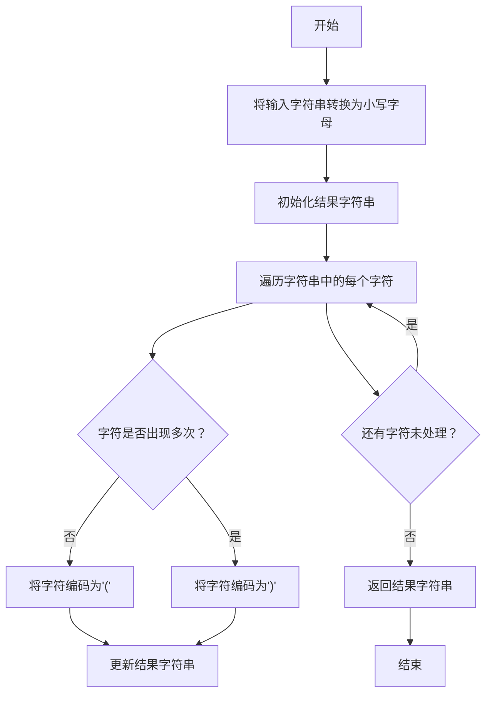

# 实验三 Python列表

班级： 21计科2班

学号： B20210302211

姓名： 刘鑫

Github地址：<https://github.com/leonidluo/python_course>

CodeWars地址：<https://www.codewars.com/users/Leonid712>

---

## 实验目的

1. 学习Python的简单使用和列表操作
2. 学习Python中的if语句

## 实验环境

1. Git
2. Python 3.10
3. VSCode
4. VSCode插件

## 实验内容和步骤

### 第一部分

Python列表操作

完成教材《Python编程从入门到实践》下列章节的练习：

- 第3章 列表简介
- 第4章 操作列表
- 第5章 if语句

---

### 第二部分

在[Codewars网站](https://www.codewars.com)注册账号，完成下列Kata挑战：

---


#### 第一题：3和5的倍数（Multiples of 3 or 5）

难度： 6kyu

如果我们列出所有低于 10 的 3 或 5 倍数的自然数，我们得到 3、5、6 和 9。这些数的总和为 23. 完成一个函数，使其返回小于某个整数的所有是3 或 5 的倍数的数的总和。此外，如果数字为负数，则返回 0。

注意：如果一个数同时是3和5的倍数，应该只被算一次。

**提示：首先使用列表解析得到一个列表，元素全部是3或者5的倍数。
使用sum函数可以获取这个列表所有元素的和.**

代码提交地址：
<https://www.codewars.com/kata/514b92a657cdc65150000006>

---

#### 第二题： 重复字符的编码器（Duplicate Encoder）

难度： 6kyu

本练习的目的是将一个字符串转换为一个新的字符串，如果新字符串中的每个字符在原字符串中只出现一次，则为"("，如果该字符在原字符串中出现多次，则为")"。在判断一个字符是否是重复的时候，请忽略大写字母。

例如:

```python
"din"      =>  "((("
"recede"   =>  "()()()"
"Success"  =>  ")())())"
"(( @"     =>  "))(("
```

代码提交地址:
<https://www.codewars.com/kata/54b42f9314d9229fd6000d9c>

---

#### 第三题：括号匹配（Valid Braces）

难度：6kyu

写一个函数，接收一串括号，并确定括号的顺序是否有效。如果字符串是有效的，它应该返回True，如果是无效的，它应该返回False。
例如：

```python
"(){}[]" => True 
"([{}])" => True
 "(}" => False
 "[(])" => False 
"[({})](]" => False
```

**提示：
python中没有内置堆栈数据结构，可以直接使用`list`来作为堆栈，其中`append`方法用于入栈，`pop`方法可以出栈。**

代码提交地址
<https://www.codewars.com/kata/5277c8a221e209d3f6000b56>

---

#### 第四题： 从随机三元组中恢复秘密字符串(Recover a secret string from random triplets)

难度： 4kyu

有一个不为你所知的秘密字符串。给出一个随机三个字母的组合的集合，恢复原来的字符串。

这里的三个字母的组合被定义为三个字母的序列，每个字母在给定的字符串中出现在下一个字母之前。"whi "是字符串 "whatisup "的一个三个字母的组合。

作为一种简化，你可以假设没有一个字母在秘密字符串中出现超过一次。

对于给你的三个字母的组合，除了它们是有效的三个字母的组合以及它们包含足够的信息来推导出原始字符串之外，你可以不做任何假设。特别是，这意味着秘密字符串永远不会包含不出现在给你的三个字母的组合中的字母。

测试用例：

```python
secret = "whatisup"
triplets = [
  ['t','u','p'],
  ['w','h','i'],
  ['t','s','u'],
  ['a','t','s'],
  ['h','a','p'],
  ['t','i','s'],
  ['w','h','s']
]
test.assert_equals(recoverSecret(triplets), secret)
```

代码提交地址：
<https://www.codewars.com/kata/53f40dff5f9d31b813000774/train/python>

提示：

- 利用集合去掉`triplets`中的重复字母，得到字母集合`letters`，最后的`secret`应该由集合中的字母组成，`secret`长度也等于该集合。

```python
letters = {letter for triplet in triplets for letter in triplet }
length = len(letters)
```

- 创建函数`check_first_letter(triplets, first_letter)`，检测一个字母是不是secret的首字母，返回True或者False。
- 创建函数`remove_first_letter(triplets, first_letter)`,  从三元组中去掉首字母，返回新的三元组。
- 遍历字母集合letters，利用上面2个函数得到最后的结果`secret`。

---

#### 第五题： 去掉喷子的元音（Disemvowel Trolls）

难度： 7kyu

喷子正在攻击你的评论区!
处理这种情况的一个常见方法是删除喷子评论中的所有元音(字母：a,e,i,o,u)，以消除威胁。
你的任务是写一个函数，接收一个字符串并返回一个去除所有元音的新字符串。
例如，字符串 "This website is for losers LOL!"   将变成 "Ths wbst s fr lsrs LL!".

注意：对于这个Kata来说，y不被认为是元音。
代码提交地址：
<https://www.codewars.com/kata/52fba66badcd10859f00097e>

提示：

- 首先使用列表解析得到一个列表，列表中所有不是元音的字母。
- 使用字符串的join方法连结列表中所有的字母，例如：

```python
last_name = "lovelace"
letters = [letter for letter in last_name ]
print(letters) # ['l', 'o', 'v', 'e', 'l', 'a', 'c', 'e']
name = ''.join(letters) # name = "lovelace"
```

---


### 第四部分

使用Mermaid绘制程序流程图

安装Mermaid的VSCode插件：

- Markdown Preview Mermaid Support
- Mermaid Markdown Syntax Highlighting


## 实验过程与结果


### 一.codewars做题
#### 第一题：3和5的倍数（Multiples of 3 or 5）
源代码：
``````python

def solution(number):
    sum = 0
    for i in range(1,number):
        if i%3==0 or i%5==0:
            sum+=i
    return sum

``````


#### 第二题： 重复字符的编码器（Duplicate Encoder）
``````python
def duplicate_encode(word):
    word = word.lower()  # 将字符串转换为小写字母
    result = ''
    for char in word:
        if word.count(char) > 1:
            result += ')'
        else:
            result += '('
    return result

``````
#### 第三题：括号匹配（Valid Braces）
``````python
def validBraces(string):
    stack = []  # 用于模拟栈的列表

    # 定义一个字典，将右括号映射到对应的左括号
    mapping = {')': '(', '}': '{', ']': '['}

    # 遍历输入字符串中的每个字符
    for char in string:
        if char in mapping:  # 如果是右括号
            # 如果栈为空或栈顶不匹配当前右括号，返回 False
            if not stack or stack.pop() != mapping[char]:
                return False
        else:  # 如果是左括号，将其入栈
            stack.append(char)

    # 最终，如果栈为空，说明所有括号都匹配，否则无效
    return not stack


``````

#### 第四题： 从随机三元组中恢复秘密字符串(Recover a secret string from random triplets)

>暂时未写

#### 第五题： 去掉喷子的元音（Disemvowel Trolls）
``````python

def disemvowel(string_):
    vowels = "AEIOUaeiou"  # 定义一个包含所有元音字母的字符串
    result = ""
    for char in string_:
        if char not in vowels:
            result += char
    return result

``````


#### 二.mermaid流程图
#### 第三题：括号匹配（Valid Braces）


## 实验考查

1. Python中的列表可以进行以下操作：
   - 添加元素：使用`append()`方法将元素添加到列表末尾。
   - 插入元素：使用`insert()`方法在指定位置插入元素。
   - 删除元素：使用`remove()`方法删除指定元素，或使用`pop()`方法删除指定位置的元素。
   - 切片操作：使用切片操作符`[]`来获取部分列表。
   - 合并列表：使用`+`操作符或`extend()`方法将两个列表合并。
   - 查找元素：使用`in`关键字来检查元素是否在列表中。
   - 获取列表长度：使用`len()`函数获取列表的长度。

2. Python的列表排序方法有：
   - `sort()`方法：原地对列表进行排序，修改原列表。
   - `sorted()`函数：返回一个新的已排序列表，不改变原列表。区别在于`sort()`是原地排序，而`sorted()`返回新列表。

3. 要将Python列表逆序打印，可以使用切片操作：
   ```python
   my_list = [1, 2, 3, 4, 5]
   reversed_list = my_list[::-1]
   print(reversed_list)
   ```

4. Python列表在以下操作时效率较高：
   - 访问元素：通过索引访问元素速度很快。
   - 尾部添加和删除：`append()`和`pop()`方法在尾部添加和删除元素效率较高。
   
   Python列表在以下操作时效率较低：
   - 在中间插入或删除元素：这会导致其他元素的移动，效率较低。
   - 查询特定元素位置：如果需要频繁查询元素位置，效率较低。
   
   如果需要更高效的插入和删除操作，可以考虑使用双向链表（`collections.deque`），而如果需要高效的查询操作，可以使用集合（`set`）或字典（`dict`）。

5. 《Fluent Python》Chapter 2介绍了Python中不同类型的序列，包括列表、元组和字符串。主要内容包括：
   - 列表是动态数组，可以包含不同类型的元素，支持多种操作。
   - 元组是不可变的序列，通常用于包含不同类型的元素，并且可以用作字典的键。
   - 字符串是不可变的序列，提供了各种字符串操作。
   - 序列支持通用的序列操作，如索引、切片、迭代、拼接等。
   - 列表推导式和生成器表达式用于简洁地创建新序列。
   - 序列的鲁棒性和不可变性有助于编写可靠的代码。
   - 序列的性能特点因类型而异，选择合适的序列类型非常重要。

## 实验总结


1. **编程工具的使用**：我使用了编程工具来编写、测试和运行代码，包括Python，Mermaid（流程图示例）以及Markdown格式。

2. **数据结构**：我使用了数据结构，如列表（list）和字典（dictionary），来处理和操作数据。特别是在解决检查括号有效性和字符串处理的问题中使用了数据结构。

3. **程序语言的语法**：我熟练地使用了Python编程语言的语法，包括变量、条件语句、循环、函数定义等，来解决问题。

4. **算法**：我应用了算法来解决不同类型的问题。特别是在解决检查括号有效性和删除元音字母的问题时，我使用了栈（stack）数据结构来实现算法。

5. **编程技巧**：我使用了各种编程技巧，如字符串操作、列表迭代、字典的使用和条件判断等，来解决问题。


