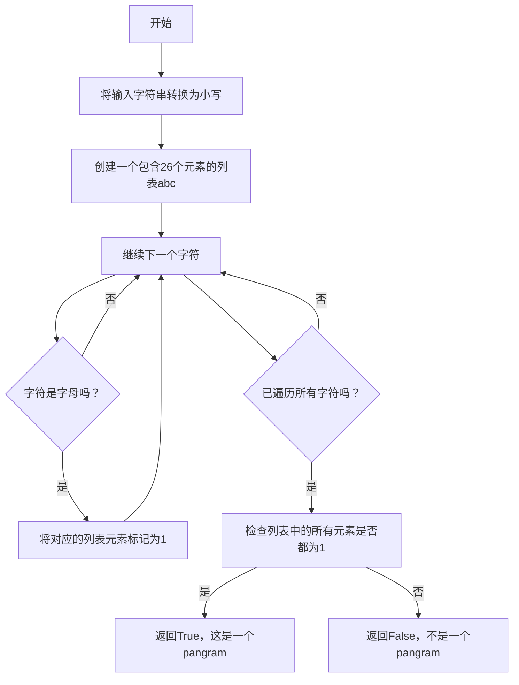

# 实验五 Python数据结构与数据模型

班级： 21计科2班

学号： B20210302211

姓名： 刘鑫

Github地址：<https://github.com/leonidluo/python_course>

CodeWars地址：<https://www.codewars.com/users/Leonid712>

---

## 实验目的

1. 学习Python数据结构的高级用法
2. 学习Python的数据模型

## 实验环境

1. Git
2. Python 3.10
3. VSCode
4. VSCode插件

## 实验内容和步骤

### 第一部分

Python列表操作

完成教材《Python编程从入门到实践》下列章节的练习：

- 第6章 字典
- 第7章 用户输入和while循环

---

### 第二部分

在[Codewars网站](https://www.codewars.com)注册账号，完成下列Kata挑战：

---

#### 第一题：停止逆转我的单词

难度： 6kyu

编写一个函数，接收一个或多个单词的字符串，并返回相同的字符串，但所有5个或更多的字母单词都是相反的（就像这个Kata的名字一样）。传入的字符串将只由字母和空格组成。只有当出现一个以上的单词时，才会包括空格。
例如：

```python
spinWords( "Hey fellow warriors" ) => returns "Hey wollef sroirraw" 
spinWords( "This is a test") => returns "This is a test" 
spinWords( "This is another test" )=> returns "This is rehtona test"
```

代码提交地址：
<https://www.codewars.com/kata/5264d2b162488dc400000001>

提示：

- 利用str的split方法可以将字符串分为单词列表
例如：

```python
words = "hey fellow warrior".split()
# words should be ['hey', 'fellow', 'warrior']
```

- 利用列表推导将长度大于等于5的单词反转(利用切片word[::-1])
- 最后使用str的join方法连结列表中的单词。

---

#### 第二题： 发现离群的数(Find The Parity Outlier)

难度：6kyu

给你一个包含整数的数组（其长度至少为3，但可能非常大）。该数组要么完全由奇数组成，要么完全由偶数组成，除了一个整数N。请写一个方法，以该数组为参数，返回这个 "离群 "的N。

例如：

```python
[2, 4, 0, 100, 4, 11, 2602, 36]
# Should return: 11 (the only odd number)

[160, 3, 1719, 19, 11, 13, -21]
# Should return: 160 (the only even number)
```

代码提交地址：
<https://www.codewars.com/kata/5526fc09a1bbd946250002dc>

---

#### 第三题： 检测Pangram

难度：6kyu

pangram是一个至少包含每个字母一次的句子。例如，"The quick brown fox jumps over the lazy dog "这个句子就是一个pangram，因为它至少使用了一次字母A-Z（大小写不相关）。

给定一个字符串，检测它是否是一个pangram。如果是则返回`True`，如果不是则返回`False`。忽略数字和标点符号。
代码提交地址：
<https://www.codewars.com/kata/545cedaa9943f7fe7b000048>

---
#### 第四题： 数独解决方案验证

难度：6kyu

数独背景

数独是一种在 9x9 网格上进行的游戏。游戏的目标是用 1 到 9 的数字填充网格的所有单元格，以便每一列、每一行和九个 3x3 子网格（也称为块）中的都包含数字 1 到 9。更多信息请访问：<http://en.wikipedia.org/wiki/Sudoku>

编写一个函数接受一个代表数独板的二维数组，如果它是一个有效的解决方案则返回 true，否则返回 false。数独板的单元格也可能包含 0，这将代表空单元格。包含一个或多个零的棋盘被认为是无效的解决方案。棋盘总是 9 x 9 格，每个格只包含 0 到 9 之间的整数。

代码提交地址：
<https://www.codewars.com/kata/63d1bac72de941033dbf87ae>

---

#### 第五题： 疯狂的彩色三角形

难度： 2kyu

一个彩色的三角形是由一排颜色组成的，每一排都是红色、绿色或蓝色。连续的几行，每一行都比上一行少一种颜色，是通过考虑前一行中的两个相接触的颜色而产生的。如果这些颜色是相同的，那么新的一行就使用相同的颜色。如果它们不同，则在新的一行中使用缺失的颜色。这个过程一直持续到最后一行，只有一种颜色被生成。

例如：
```python
Colour here:            G G        B G        R G        B R
Becomes colour here:     G          R          B          G
```


一个更大的三角形例子：

```python
R R G B R G B B
 R B R G B R B
  G G B R G G
   G R G B G
    B B R R
     B G R
      R B
       G
```

你将得到三角形的第一行字符串，你的工作是返回最后的颜色，这将出现在最下面一行的字符串。在上面的例子中，你将得到 "RRGBRGBB"，你应该返回 "G"。
限制条件： 1 <= length(row) <= 10 ** 5
输入的字符串将只包含大写字母'B'、'G'或'R'。

例如：

```python
triangle('B') == 'B'
triangle('GB') == 'R'
triangle('RRR') == 'R'
triangle('RGBG') == 'B'
triangle('RBRGBRB') == 'G'
triangle('RBRGBRBGGRRRBGBBBGG') == 'G'
```

代码提交地址：
<https://www.codewars.com/kata/5a331ea7ee1aae8f24000175>

提示：请参考下面的链接，利用三进制的特点来进行计算。
<https://stackoverflow.com/questions/53585022/three-colors-triangles>

---


### 第三部分

使用Mermaid绘制程序流程图

安装Mermaid的VSCode插件：

- Markdown Preview Mermaid Support
- Mermaid Markdown Syntax Highlighting


## 实验过程与结果


### 一.codewars做题
#### 第一题：停止逆转我的单词
源代码：
``````python

def spin_words(sentence):
    words = sentence.split()
    anser = []
    for word in words :
        if len(word) >= 5:
            # 如果单词长度大于等于5，就反转单词
            anser.append(word[::-1])
        else:
            anser.append(word)
    return " ".join(anser)

    


``````


#### 第二题： 发现离群的数(Find The Parity Outlier)
``````python

def find_outlier(integers):
    fg = 0
    fg2 = 0 
    for i in integers:
        if i % 2 == 0:
            fg = fg + 1
        else :
            fg2 = fg2 + 1
        if fg >= 2 : 
            fg2=0
            break
        if fg2 >=2 :
            fg = 0
            break
      
    if fg  :        #奇数为独数
        for i in integers:
            if i % 2 == 1:
                return i
    else :             #偶数为独数
        for i in integers:
            if i % 2 == 0:
                return i
    

``````
#### 第三题： 检测Pangram
``````python

def is_pangram(s):
    s=s.lower()
    abc = [0,0,0,0,0,0,0,0,0,0,0,0,0,0,0,0,0,0,0,0,0,0,0,0,0,0]
    for char in s:
        if ord(char) >= ord('a') and ord(char) <= ord('z'):
            abc[ord(char)-ord('a')] = 1 
    for ans in abc :
        if ans != 1 :
            return False
        
    return True 


``````

#### 第四题： 数独解决方案验证
``````python

def validate_sudoku(board):
    checkfg = [1,1,1,1,1,1,1,1,1]
    
    
    for row in range(9):
        for ro in range(9):
            if board[row][ro]<=0 or board[row][ro] > 9:
                return False
            checkfg[board[row][ro]-1]=0
        for check in checkfg:
            if check == 1:
                return False
        checkfg[:] = [1] * len(checkfg) #恢复check数组
        
    
    # 检查每一列
    for col in range(9):
        for co in range(9):
            checkfg[board[co][col]-1]=0
        for check in checkfg:
            if check == 1:
                return False
        checkfg[:] = [1] * len(checkfg) #恢复check数组

    # 检查每一个3x3子网格
    for d in range(3):
        for k in range(3):
            for i in range(3):
                for j in range(3):
                    checkfg[board[3*d+i][3*k+j]-1]=0
            for check in checkfg:
                if check == 1:
                    return False
            checkfg[:] = [1] * len(checkfg) #恢复check数组

    return True

``````


#### 第五题： 疯狂的彩色三角形

>暂时未写

#### 二.mermaid流程图
#### 第三题： RNA到蛋白质序列的翻译（RNA to Protein Sequence Translation）




## 实验考查


1. **集合（Set）类型特点和与列表（List）类型的区别**:
   - 集合是无序、不重复的，列表是有序、允许重复的。
   - 集合使用 `{}` 或 `set()` 创建，列表使用 `[]` 创建。

2. **集合（Set）类型主要操作**:
   - 添加元素: `add()`
   - 删除元素: `remove()`, `discard()`
   - 集合运算: 并集 `union()`, 交集 `intersection()`, 差集 `difference()`, 对称差集 `symmetric_difference()`
   - 子集检查: `issubset()`
   - 超集检查: `issuperset()`

3. 使用 `*` 操作符作用到列表上会将列表中的元素重复多次，不适用于嵌套列表。

4. **解析（Comprehension）的使用方法**:
   - **列表解析**: `[expression for item in iterable]`
   - **集合解析**: `{expression for item in iterable}`
   - **字典解析**: `{key: value for item in iterable}`

## 实验总结


1. **编程工具的使用**:
   - 我使用了Python编程语言来解决各种编程问题。
   - 了解了Python中的各种内置函数和模块，如字符串操作、集合操作等。

2. **数据结构**:
   - 掌握了不同数据结构的特点和用途，包括列表（List）、集合（Set）、字典（Dictionary）等。
   - 学习了如何使用这些数据结构来组织和操作数据。

3. **程序语言的语法**:
   - 深入了解了Python语言的语法规则，包括变量、数据类型、条件语句、循环语句等。
   - 学会了如何编写清晰和可读的代码。

4. **算法**:
   - 解决了各种算法问题，包括字符串处理、数据验证、数独验证等。
   - 学到了如何设计和实现算法来解决复杂问题。


5. **编程思想**:
   - 强调了编程思想的重要性，如问题分解、模块化、重用性等。
   - 学到了如何以更有效和高效的方式解决问题。


