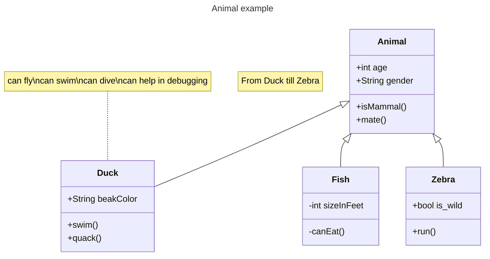

# 实验�? Python面向对象编程

�?���? 21计�?1

学号�? 202302200000

姓名�? 张三

Github地址�?<https://github.com/yourusername/python_course>

CodeWars地址�?<https://www.codewars.com/users/yourusername>

---

## 实验�?��

1. 学习Python类和继承的基础知识
2. 学习namedtuple和DataClass的使�?

## 实验�??

1. Git
2. Python 3.10
3. VSCode
4. VSCode插件

## 实验内�?和�?�?

### �?��部分

Python面向对象编程

完成教材《Python编程从入门到实践》下列章节的练习�?

- �?9�? �?

---

### �?��部分

在[Codewars网站](https://www.codewars.com)注册账号，完成下列Kata挑战�?

---

#### �?��题：面向对象的海�?

难度�? 8kyu

啊哈，伙�?!

你是一�?��海盗团的首�?。而且你有一�??划。在OOP的帮助下，你希望建立一�?��当有效的系统来识�?��上有大量战利品的船只�?
对你来�?，不幸的�?��现在的人很重，那么你怎么知道一艘船上�?的是黄金而不�?���?��

你�?先�?写一�?��用的船舶类�?

```python
class Ship:
    def __init__(self, draft, crew):
        self.draft = draft
        self.crew = crew
```

每当你的间谍看到一艘新船进入码头，他们将根�??察结果创建一�?��的船舶�?象�?

- `draft`吃水 - 根据船在水中的高度来估�?它的重量
- `crew`船员 - 船上船员的数�?

`Titanic = Ship(15, 10)`

任务

你可以�?�?��舶的 "draft(吃水) "�? "crew(船员)"�?"draft(吃水) "�?��的总重量，"船员 "�?��上的人数�?
每个船员都会给船的吃水�?�?1.5�?��位。�?果除去船员的重量后，吃水仍然超过20，那么这艘船就值得掠夺。任何有这么重的船一定有很�?战利�?!
添加方法
`is_worth_it`
来决定这艘船�?��值得掠夺�?

例�?�?

```python
Titanic.is_worth_it()
False
```

祝你好运，愿你能找到金子!

代码提交地址�?
<https://www.codewars.com/kata/54fe05c4762e2e3047000add>

---

#### �?��题： �?���?��

难度�?7kyu

写一�?��建Block的类（Duh.�?
构造函数应该接受一�?��组作为参数，这个数组将包�?3�?��数，其形式为`[width, length, height]`，Block应�?由这些整数创建�?

定义这些方法:

- `get_width()` return the width of the `Block`
- `get_length()` return the length of the `Block`
- `get_height()` return the height of the `Block`
- `get_volume()` return the volume of the `Block`
- `get_surface_area()` return the surface area of the `Block`

例子�?

```python
b = Block([2,4,6]) # create a `Block` object with a width of `2` a length of `4` and a height of `6`
b.get_width() # return 2    
b.get_length() # return 4
b.get_height() # return 6
b.get_volume() # return 48
b.get_surface_area() # return 88
```

注意�? 不需要�?查错�?��参数�?

代码提交地址�?
<https://www.codewars.com/kata/55b75fcf67e558d3750000a3>

---

#### �?��题： 分页助手

难度�?5kyu

在这�?��习中，你将加强�?分页的掌握。你将完成PaginationHelper类，这是一�?��用类，有助于查�?与数组有关的分页信息�?
该类�??计成接收一�?��的数组和一�?��数，表示每页允�?多少�?���?��集�?/数组�?���?��值的类型并不相关�?

下面�?��些关于�?何使用这�?��的例子：

```python
helper = PaginationHelper(['a','b','c','d','e','f'], 4)
helper.page_count() # should == 2
helper.item_count() # should == 6
helper.page_item_count(0)  # should == 4
helper.page_item_count(1) # last page - should == 2
helper.page_item_count(2) # should == -1 since the page is invalid

# page_index takes an item index and returns the page that it belongs on
helper.page_index(5) # should == 1 (zero based index)
helper.page_index(2) # should == 0
helper.page_index(20) # should == -1
helper.page_index(-10) # should == -1 because negative indexes are invalid
```

代码提交地址�?
<https://www.codewars.com/kata/515bb423de843ea99400000a>

---

#### �?��题： 向量（Vector）类

难度�? 5kyu

创建一�?��持加法、减法、点�?��向量长度的向量（Vector）类�?

举例来�?�?

```python
a = Vector([1, 2, 3])
b = Vector([3, 4, 5])
c = Vector([5, 6, 7, 8])

a.add(b)      # should return a new Vector([4, 6, 8])
a.subtract(b) # should return a new Vector([-2, -2, -2])
a.dot(b)      # should return 1*3 + 2*4 + 3*5 = 26
a.norm()      # should return sqrt(1^2 + 2^2 + 3^2) = sqrt(14)
a.add(c)      # raises an exception
```

如果你试图�?两个不同长度的向量进行加减或点缀，你必须抛出一�?���?�?
向量类还应�?提供�?

- 一�? `__str__` 方法，这�? `str(a) === '(1,2,3)'` 
- 一个equals方法，用来�?查两�?��有相同成分的向量�?��相等�?

注意：测试�?例将利用用户提供的equals方法�?

代码提交地址�?
<https://www.codewars.com/kata/526dad7f8c0eb5c4640000a4>

---

#### �?��题： Codewars风格的等级系�?

难度�? 4kyu

编写一�?��为User的类，用于�?算用户在类似于Codewars使用的排名系统中的进步量�?

业务规则�?

- 一�?��户从等级-8开始，�?��一直进步到8�?
- 没有0（零）等级。在-1之后的下一�?��级是1�?
- 用户将完成活动。这些活动也有等级�?
- 每当用户完成一�?��等级的活�?��用户的等级进度就会根�?��动的等级进�?更新�?
- 完成活动获得的进度是相�?于用户当前的等级与活动的等级而言的�?
- 用户的等级进度从零开始，每当进度达到100时，用户的等级就会升级到下一�?��级�?
- 在上一等级时获得的任何剩余进度都将�?��用于下一等级的进度（我们不会丢弃任何进度）。例外的情况�?��如果没有其他等级的进展（一旦你达到8级，就没有更多的进展了）�?
- 一�?��户不能超�?8级�?
- �?���?��受的等级值范围是-8,-7,-6,-5,-4,-3,-2,-1,1,2,3,4,5,6,7,8。任何其他的值都应�?引起错�?�?

逻辑案例�?

- 如果一�?��名为-8的用户完成了一�?��名为-7的活�?��他们将获�?10的进度�?
- 如果一�?��名为-8的用户完成了排名�?-6的活�?��他们将获�?40的进展�?
- 如果一�?��名为-8的用户完成了排名�?-5的活�?��他们将获�?90的进展�?
- 如果一�?���?-8的用户完成了排名-4的活�?��他们将获�?160�?��度，从而使该用户升级到排名-7，并获得60�?��度以获得下一�?��名�?
- 如果一�?��级为-1的用户完成了一�?��级为1的活�?��他们将获�?10�?��度（记住，零等级会�?忽略）�?

代码案例�?

```python
user = User()
user.rank # => -8
user.progress # => 0
user.inc_progress(-7)
user.progress # => 10
user.inc_progress(-5) # will add 90 progress
user.progress # => 0 # progress is now zero
user.rank # => -7 # rank was upgraded to -7
```

代码提交地址�?
<https://www.codewars.com/kata/51fda2d95d6efda45e00004e>

---

### �?��部分

使用Mermaid绘制程序�?**类图**

安�?VSCode插件�?

- Markdown Preview Mermaid Support
- Mermaid Markdown Syntax Highlighting

使用Markdown�?��绘制你的程序绘制程序类图（至少一�?��，Markdown代码如下�?


显示效果如下�?



查看Mermaid类图的�?�?-->[点击这里](https://mermaid.js.org/syntax/classDiagram.html)

使用Markdown编辑�?��例�?VScode）编写本次实验的实验报告，包括[实验过程与结果](#实验过程与结�?)、[实验考查](#实验考查)和[实验总结](#实验总结)，并将其导出�? **PDF格式** 来提交�?

## 实验过程与结�?

请将实验过程与结果放在这里，包括�?

- [�?��部分 Python面向对象编程](#�?��部分)
- [�?��部分 Codewars Kata挑战](#�?��部分)
- [�?��部分 使用Mermaid绘制程序流程图](#�?��部分)

注意代码需要使用markdown的代码块格式化，例�?Git命令行�?句应该使用下面的格式�?


显示效果如下�?

```bash
git init
git add .
git status
git commit -m "first commit"
```

如果是Python代码，应该使用下�?��码块格式，例如：


显示效果如下�?

```python
def add_binary(a,b):
    return bin(a+b)[2:]
```

代码运�?结果的文�?��以直接粘贴在这里�?

**注意：不要使用截图，Markdown文档�?��为Pdf格式后，�?���?��会无法显示�?**

## 实验考查

请使用自己的�?��并使用尽量简�?��码示例回答下面的�??，这些问题将在实验�?查时用于提问和答辩以及实际的操作�?

1. Python的类中__init__方法起什么作�?��
2. Python�?���??何继承父类和改写（override）父类的方法�?
3. Python类有那些特殊的方法？它们的作用是什么？请举三个例子并编写简单的代码说明�?

## 实验总结

总结一下这次实验你学习和使用到的知识，例�?：编程工具的使用、数�?��构、程序�?言的�?法、算法、编程技巧、编程思想�?
