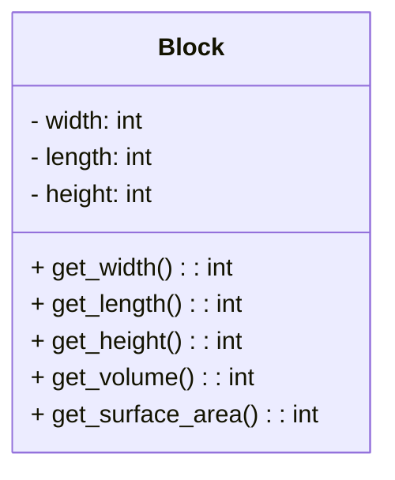

# 实验七 Python面向对象编程

班级： 21计科2班

学号： B20210302211

姓名： 刘鑫

Github地址：<https://github.com/leonidluo/python_course>

CodeWars地址：<https://www.codewars.com/users/Leonid712>

---

## 实验目的

1. 学习Python类和继承的基础知识
2. 学习namedtuple和DataClass的使用

## 实验环境

1. Git
2. Python 3.10
3. VSCode
4. VSCode插件

## 实验内容和步骤

### 第一部分

Python面向对象编程

完成教材《Python编程从入门到实践》下列章节的练习：

- 第9章 类

---

### 第二部分

在[Codewars网站](https://www.codewars.com)注册账号，完成下列Kata挑战：

---

#### 第一题：面向对象的海盗

难度： 8kyu

啊哈，伙计!

你是一个小海盗团的首领。而且你有一个计划。在OOP的帮助下，你希望建立一个相当有效的系统来识别船上有大量战利品的船只。
对你来说，不幸的是，现在的人很重，那么你怎么知道一艘船上装的是黄金而不是人呢？

你首先要写一个通用的船舶类。

```python
class Ship:
    def __init__(self, draft, crew):
        self.draft = draft
        self.crew = crew
```

每当你的间谍看到一艘新船进入码头，他们将根据观察结果创建一个新的船舶对象。

- `draft`吃水 - 根据船在水中的高度来估计它的重量
- `crew`船员 - 船上船员的数量

`Titanic = Ship(15, 10)`

任务

你可以访问船舶的 "draft(吃水) "和 "crew(船员)"。"draft(吃水) "是船的总重量，"船员 "是船上的人数。
每个船员都会给船的吃水增加1.5个单位。如果除去船员的重量后，吃水仍然超过20，那么这艘船就值得掠夺。任何有这么重的船一定有很多战利品!
添加方法
`is_worth_it`
来决定这艘船是否值得掠夺。

例如：

```python
Titanic.is_worth_it()
False
```

祝你好运，愿你能找到金子!

代码提交地址：
<https://www.codewars.com/kata/54fe05c4762e2e3047000add>

---

#### 第二题： 搭建积木

难度：7kyu

写一个创建Block的类（Duh.）
构造函数应该接受一个数组作为参数，这个数组将包含3个整数，其形式为`[width, length, height]`，Block应该由这些整数创建。

定义这些方法:

- `get_width()` return the width of the `Block`
- `get_length()` return the length of the `Block`
- `get_height()` return the height of the `Block`
- `get_volume()` return the volume of the `Block`
- `get_surface_area()` return the surface area of the `Block`

例子：

```python
b = Block([2,4,6]) # create a `Block` object with a width of `2` a length of `4` and a height of `6`
b.get_width() # return 2    
b.get_length() # return 4
b.get_height() # return 6
b.get_volume() # return 48
b.get_surface_area() # return 88
```

注意： 不需要检查错误的参数。

代码提交地址：
<https://www.codewars.com/kata/55b75fcf67e558d3750000a3>

---

#### 第三题： 分页助手

难度：5kyu

在这个练习中，你将加强对分页的掌握。你将完成PaginationHelper类，这是一个实用类，有助于查询与数组有关的分页信息。
该类被设计成接收一个值的数组和一个整数，表示每页允许多少个项目。集合/数组中包含的值的类型并不相关。

下面是一些关于如何使用这个类的例子：

```python
helper = PaginationHelper(['a','b','c','d','e','f'], 4)
helper.page_count() # should == 2
helper.item_count() # should == 6
helper.page_item_count(0)  # should == 4
helper.page_item_count(1) # last page - should == 2
helper.page_item_count(2) # should == -1 since the page is invalid

# page_index takes an item index and returns the page that it belongs on
helper.page_index(5) # should == 1 (zero based index)
helper.page_index(2) # should == 0
helper.page_index(20) # should == -1
helper.page_index(-10) # should == -1 because negative indexes are invalid
```

代码提交地址：
<https://www.codewars.com/kata/515bb423de843ea99400000a>

---

#### 第四题： 向量（Vector）类

难度： 5kyu

创建一个支持加法、减法、点积和向量长度的向量（Vector）类。

举例来说：

```python
a = Vector([1, 2, 3])
b = Vector([3, 4, 5])
c = Vector([5, 6, 7, 8])

a.add(b)      # should return a new Vector([4, 6, 8])
a.subtract(b) # should return a new Vector([-2, -2, -2])
a.dot(b)      # should return 1*3 + 2*4 + 3*5 = 26
a.norm()      # should return sqrt(1^2 + 2^2 + 3^2) = sqrt(14)
a.add(c)      # raises an exception
```

如果你试图对两个不同长度的向量进行加减或点缀，你必须抛出一个错误。
向量类还应该提供：

- 一个 `__str__` 方法，这样 `str(a) === '(1,2,3)'` 
- 一个equals方法，用来检查两个具有相同成分的向量是否相等。

注意：测试案例将利用用户提供的equals方法。

代码提交地址：
<https://www.codewars.com/kata/526dad7f8c0eb5c4640000a4>

---

#### 第五题： Codewars风格的等级系统

难度： 4kyu

编写一个名为User的类，用于计算用户在类似于Codewars使用的排名系统中的进步量。

业务规则：

- 一个用户从等级-8开始，可以一直进步到8。
- 没有0（零）等级。在-1之后的下一个等级是1。
- 用户将完成活动。这些活动也有等级。
- 每当用户完成一个有等级的活动，用户的等级进度就会根据活动的等级进行更新。
- 完成活动获得的进度是相对于用户当前的等级与活动的等级而言的。
- 用户的等级进度从零开始，每当进度达到100时，用户的等级就会升级到下一个等级。
- 在上一等级时获得的任何剩余进度都将被应用于下一等级的进度（我们不会丢弃任何进度）。例外的情况是，如果没有其他等级的进展（一旦你达到8级，就没有更多的进展了）。
- 一个用户不能超过8级。
- 唯一可接受的等级值范围是-8,-7,-6,-5,-4,-3,-2,-1,1,2,3,4,5,6,7,8。任何其他的值都应该引起错误。

逻辑案例：

- 如果一个排名为-8的用户完成了一个排名为-7的活动，他们将获得10的进度。
- 如果一个排名为-8的用户完成了排名为-6的活动，他们将获得40的进展。
- 如果一个排名为-8的用户完成了排名为-5的活动，他们将获得90的进展。
- 如果一个排名-8的用户完成了排名-4的活动，他们将获得160个进度，从而使该用户升级到排名-7，并获得60个进度以获得下一个排名。
- 如果一个等级为-1的用户完成了一个等级为1的活动，他们将获得10个进度（记住，零等级会被忽略）。

代码案例：

```python
user = User()
user.rank # => -8
user.progress # => 0
user.inc_progress(-7)
user.progress # => 10
user.inc_progress(-5) # will add 90 progress
user.progress # => 0 # progress is now zero
user.rank # => -7 # rank was upgraded to -7
```

代码提交地址：
<https://www.codewars.com/kata/51fda2d95d6efda45e00004e>

---
## 实验过程与结果


### 一.codewars做题

#### 第一题：面向对象的海盗
```python
class Ship:
    def __init__(self, draft, crew):
        self.draft = draft
        self.crew = crew
    def is_worth_it(self):
        if ( self.draft - self.crew ) > 20 :
            return True 
        return False
```
#### 第二题： 搭建积木
```python
class Block:
    # Good Luck!
    def __init__(self, arr):
        self.width = arr[0]
        self.length = arr[1]
        self.height = arr[2]
    def get_width(self) :
        return self.width
    def get_length(self) :
        return self.length
    def get_height(self) :
        return self.height
    
    def get_volume(self) :
        return self.width*self.height*self.length
    
    def get_surface_area(self) :
        return self.width*self.height*2+self.height*self.length*2+self.width*self.length*2


```
#### 第三题： 分页助手
```python
class PaginationHelper:
    

    def __init__(self, collection, items_per_page):
        self.collection=collection
        self.items_per_page = items_per_page
        if(len(collection)%items_per_page!=0):
            self.full_page_count = len(collection)//items_per_page
        else:
            self.full_page_count = len(collection)//items_per_page-1
        self.lastPage_item_count = len(collection)-self.full_page_count*items_per_page

    def item_count(self):
        return len(self.collection)
    

    def page_count(self):
        if len(self.collection)!= 0:
            return self.full_page_count+1
        return 0
    
    
    def page_index(self, page_index):
        if(page_index<len(self.collection) and page_index>=0):
            return page_index//self.items_per_page
        else :
            return -1
    
    
    def page_item_count(self, item_index):
        if self.full_page_count < 0 :
            return -1
        if item_index < self.full_page_count and item_index >= 0:
            return self.items_per_page
        elif item_index == self.full_page_count:
            return self.lastPage_item_count
        else :
            return -1
```
#### 第四题： 向量（Vector）类
```python

import math

class Vector:
    def __init__(self, components):
        self.components = components

    def __str__(self):
        return '(' + ','.join(map(str, self.components)) + ')'

    def __len__(self):
        return len(self.components)

    def add(self, other):
        if len(self) != len(other):
            raise ValueError('Vectors must have the same length')
        result = [a + b for a, b in zip(self.components, other.components)]
        return Vector(result)

    def sub(self, other):
        if len(self) != len(other):
            raise ValueError('Vectors must have the same length')
        result = [a - b for a, b in zip(self.components, other.components)]
        return Vector(result)
    
    def subtract(self, other):
        if len(self) != len(other):
            raise ValueError('Vectors must have the same length')
        result = [a - b for a, b in zip(self.components, other.components)]
        return Vector(result)
    
    def dot(self, other):
        if len(self) != len(other):
            raise ValueError('Vectors must have the same length')
        result = sum(a * b for a, b in zip(self.components, other.components))
        return result

    def norm(self):
        result = math.sqrt(sum(a * a for a in self.components))
        return result

    def equals(self, other):
        if len(self) != len(other):
            return False
        return all(a == b for a, b in zip(self.components, other.components))

```
#### 第五题： Codewars风格的等级系统
>暂时未写


### 二.mermaid
使用Mermaid绘制程序的**类图**
#### 第二题： 搭建积木



## 实验考查


1. **集合（Set）类型特点和与列表（List）类型的区别**:
   - 集合是无序、不重复的，列表是有序、允许重复的。
   - 集合使用 `{}` 或 `set()` 创建，列表使用 `[]` 创建。

2. **集合（Set）类型主要操作**:
   - 添加元素: `add()`
   - 删除元素: `remove()`, `discard()`
   - 集合运算: 并集 `union()`, 交集 `intersection()`, 差集 `difference()`, 对称差集 `symmetric_difference()`
   - 子集检查: `issubset()`
   - 超集检查: `issuperset()`

3. 使用 `*` 操作符作用到列表上会将列表中的元素重复多次，不适用于嵌套列表。

4. **解析（Comprehension）的使用方法**:
   - **列表解析**: `[expression for item in iterable]`
   - **集合解析**: `{expression for item in iterable}`
   - **字典解析**: `{key: value for item in iterable}`
## 实验总结

总结一下这次实验你学习和使用到的知识，例如：编程工具的使用、数据结构、程序语言的语法、算法、编程技巧、编程思想。

- 使用Python编程语言解决编程问题。
- 掌握了不同数据结构的特点和用途，如列表、集合和字典。
- 深入了解了Python语言的语法规则，包括变量、条件语句和循环。
- 提高了编程技巧，包括字符串和集合操作。
- 强调了编程思想的重要性，如问题分解和模块化。