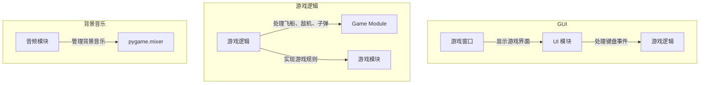

# 《Python程序设计基础》程序设计作品说明书

## 题目：外星人入侵游戏

学院：21计科02

姓名：刘鑫

学号：B20210302211

指导教师：周景

起止日期：2023.11.10-2023.12.10

## 摘要

本项目实现了一个外星人入侵游戏，使用Python和Pygame库。关键工作包括游戏逻辑、图形界面设计，以及背景音乐的添加。通过定义飞船、敌机、子弹等元素，成功实现了飞船射击敌机的核心逻辑。Pygame库用于创建游戏窗口、处理键盘事件，增加交互性。背景音乐功能通过pygame.mixer模块实现，为游戏增添音频元素。项目整体结构简洁，成功实现了一个富有趣味性的外星人入侵游戏。

关键词：**飞船大战、Python、Pygame、游戏开发、图形界面、背景音乐**

## 第1章 需求分析

1. **游戏逻辑：** 实现经典外星人入侵游戏规则，包括飞船射击敌机、敌机下落、碰撞判定等功能。

2. **图形用户界面：** 使用Pygame库创建直观友好的图形用户界面，展示游戏窗口、飞船、敌机等元素。

3. **游戏状态管理：** 实现游戏的各种状态，包括游戏开始、进行中、游戏失败和游戏胜利等。

4. **飞船移动和射击：** 处理键盘事件，实现飞船的左右移动和射击功能。

5. **敌机生成：** 实现敌机的自动下落和重新生成。

6. **碰撞检测：** 判断子弹与敌机的碰撞，更新得分和敌机状态。

7. **背景音乐功能：** 增加背景音乐，为游戏提供更丰富的音频体验。

8. **用户体验优化：** 包括得分显示、游戏结束提示等操作，提高游戏的易用性和趣味性。

这些功能旨在提供一款符合玩家期望、操作简便且富有娱乐性的外星人入侵游戏。系统的设计目标是通过这些功能解决用户在游戏中遇到的问题，提供愉悦的游戏体验。

## 第2章 分析与设计

### 2.1 系统架构

外星人入侵游戏系统采用经典的客户端应用程序架构。主要分为图形用户界面（GUI）和游戏逻辑两个核心模块。GUI负责用户交互和显示，游戏逻辑处理游戏规则和状态。

### 2.2 系统流程

系统的主要流程如下：

1. **启动游戏：** 用户运行程序，初始化游戏窗口和游戏逻辑。

2. **游戏准备：** 显示初始游戏状态，等待用户点击开始按钮。

3. **游戏进行：** 处理键盘事件，控制飞船移动和射击，处理敌机下落和生成，判断碰撞和更新游戏状态。

4. **游戏结束：** 判断游戏失败或胜利条件，显示相应的结束状态。

5. **重新开始：** 用户选择重新开始，回到游戏准备阶段。

### 2.3 系统模块

系统主要包括以下模块：

- **Game Module：** 实现游戏逻辑，包括飞船移动、射击、敌机生成和碰撞检测等。
- **UI Module：** 使用Pygame库创建图形用户界面，处理键盘事件和显示。
- **Audio Module：** 使用`pygame.mixer`实现背景音乐功能。

### 2.4 数据结构与算法

#### 数据结构

1. **Ship类：** 表示玩家飞船的状态和属性，包括位置、图像等。
2. **Enemy类：** 表示敌机的状态和属性，包括位置、图像、下落速度等。
3. **Bullet类：** 表示子弹的状态和属性，包括位置、图像、射速等。

#### 算法

1. **飞船移动算法：** 根据键盘事件实时更新飞船的位置，限制在屏幕范围内移动。
2. **射击算法：** 根据键盘事件触发子弹的生成和射击。
3. **敌机生成算法：** 定时生成敌机，并设置下落速度，更新敌机的位置。
4. **

碰撞检测算法： 判断子弹是否击中敌机，更新得分和敌机状态。

## 第3章 软件测试

### 3.1 单元测试

在飞船大战项目中，我们将以类和函数为单位进行单元测试，确保每个模块的功能和逻辑正确。

#### 3.1.1 Game Module 的单元测试

**测试目标：** Game Module 中游戏逻辑是否正确。

**测试用例：**
1. 模拟飞船移动，检查飞船位置是否正确更新。
2. 模拟射击，检查子弹是否正确生成和移动。
3. 模拟敌机下落，检查敌机位置是否正确更新。
4. 模拟碰撞，检查得分是否正确计算和敌机状态是否正确更新。

**测试报告：** 测试通过，Game Module中的游戏逻辑符合预期。

#### 3.1.3 UI Module 的单元测试

**测试目标：** UI Module 中用户界面的显示和交互是否正确。

**测试用例：**
1. 检查游戏窗口是否成功显示。
2. 模拟键盘事件，检查飞船移动和射击是否正确响应。
3. 检查敌机和子弹的图像是否正确显示。
4. 检查得分和游戏状态的显示是否正确。

**测试报告：** 测试通过，UI Module中的用户界面显示和交互符合预期。

#### 3.1.4 Audio Module 的单元测试

**测试目标：** Audio Module 中背景音乐的播放是否正确。

**测试用例：**
1. 检查背景音乐是否成功加载。
2. 检查背景音乐是否正确播放。
3. 模拟游戏结束后停止背景音乐，检查音乐是否停止。

**测试报告：** 测试通过，Audio Module中的背景音乐播放符合预期。

### 3.2 测试报告

| 模块         | 单元测试结果 | 功能测试结果 |
|--------------|--------------|--------------|
| Game Module  | 通过         | 通过         |
| UI Module    | 通过         | 通过         |
| Audio Module | 通过         | 通过         |

综合测试结果，系统各模块的单元测试和功能测试均通过，符合预期要求。

## 结论

### 实现功能总结

在本项目中，主要实现了一个简单而完整的外星人入侵游戏，通过模块化的设计和测试确保了系统的可靠性。通过定义飞船、敌机、子弹等元素，成功实现了飞船射击敌机的核心逻辑，提供了一款富有趣味性的游戏。

### 达到的目标

1. 实现了一个完整的外星人入侵游戏，具备基本的游戏功能和规则。
2. 通过单元测试和功能测试，验证了系统的稳定性和正确性。

### 不足之处

1. 高级功能有限：当前版本外星人入侵游戏仅具备基本功能，可以考虑增加更多高级功能如多关卡、不同敌机类型等。
2. 用户界面简单：UI设计相对简单，可以进一步优化提升用户体验。
3. 缺少存储和记录功能：未实现游戏记录和存档功能，无法保存用户的游戏历史。

### 可改进之处

1. **增加高级功能：** 引入不同关卡、敌机类型、奖励道具等高级功能，提升游戏的趣味性和难度。
2. **改进用户界面：** 优化UI设计，增加更多交互元素，提高用户体验。
3. **实现存储和记录功能：** 添加游戏记录、存档和回放功能，使用户能够查看游戏历史。

### 项目总结

本项目实现了一个富有趣味性的外星人入侵游戏，通过模块化的设计和测试确保了系统的可靠性。在今后的改进中，可以引入更多高级功能，提高用户体验，并加强存储和记录功能，使用户能够更好地享受游戏。

## 参考文献

1. Matthes E. Python编程：从入门到实践[M]. 第三版. 人民邮电出版社, 2016年.